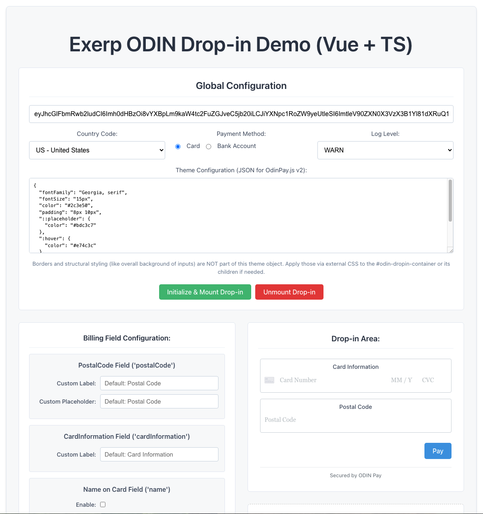

# ODIN Drop-in Demo Application

This application (`@exerp/odin-dropin-demo`) serves as a local development and testing environment for the `@exerp/odin-dropin` facade package within the `odin-dropin-workspace` monorepo.

## Purpose

*   Provides a simple UI to initialize and mount the ODIN Drop-in component.
*   Allows developers to visually inspect the rendered component.
*   Facilitates interactive testing of the component's functionality (e.g., submitting card details, handling success/error callbacks).
*   Uses the local `@exerp/odin-dropin` package via pnpm workspaces, ensuring that changes made to the library packages are reflected here after rebuilding.

<p align="center">
  
</p>

## Running the Demo

To run this demo application:

1.  Ensure all monorepo dependencies are installed (`pnpm install` from the workspace root).
2.  Ensure the library packages (`core` and `odin-dropin`) have been built (`pnpm turbo build` from the workspace root).
3.  Run the development server from the workspace root:
    ```bash
    pnpm dev --filter @exerp/odin-dropin-demo
    ```
4.  Open the URL provided by the Vite server (usually `http://localhost:5173`) in your browser.

Refer to the main workspace [README.md](../../README.md) and [QUICK_START.md](../../QUICK_START.md) for more details on the overall project structure and development workflow.