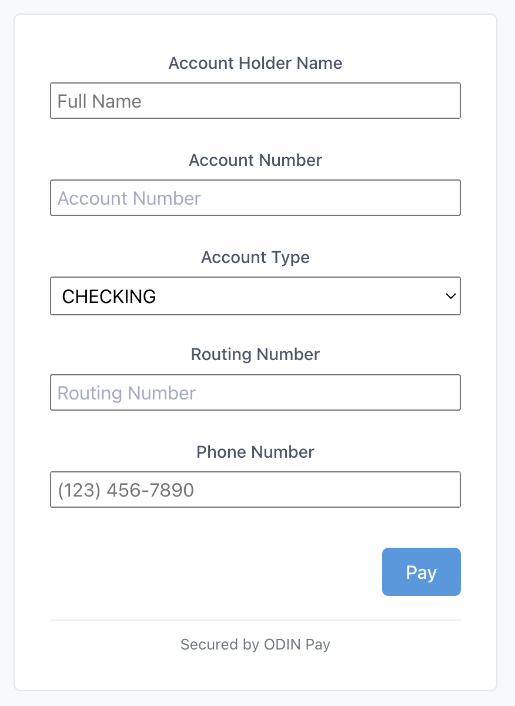

<p align="left">
  <a href="../../README.md"> 📃 Workspace README</a> -
  <a href="./CHANGELOG.md"> 📄 Changelog</a>
</p>

---
# ODIN Payment Drop-in Facade (`@exerp/odin-dropin`)

This package provides the public facade for integrating the ODIN Payment Drop-in component into web applications. It simplifies the interaction with the underlying Stencil web components and the `OdinPay.js` library.

<table>
  <tr>
    <td align="center" valign="top">
      <strong>Example: Card Payment Form</strong><br>
      
    </td>
    <td align="center" valign="top">
      <strong>Example: BANK_ACCOUNT Payment Form</strong><br>
      
    </td>
  </tr>
</table>

## Installation

```bash
# Using pnpm
pnpm add @exerp/odin-dropin

# Using npm
npm install @exerp/odin-dropin

# Using yarn
yarn add @exerp/odin-dropin
```

## API Documentation

The primary export of this package is the `OdinDropin` class.

### Importing

```javascript
// ES Module import
import {
  OdinDropin,
  type LogLevel,
  type OdinDropinInitializationParams, // For typing params
  type OdinFieldValidationEvent,      // For the Validation callback
  type OdinV2ThemeConfig,           // For the theme config
  type OdinSubmitPayload,           // For onSubmit callback
  type OdinPayErrorPayload          // For onError callback
} from '@exerp/odin-dropin';

// For UMD builds (if included via <script> tag),
// it should be available as a global variable `OdinDropin`.
// const odinDropinInstance = new window.OdinDropin({...});
```

### `new OdinDropin(params)`

Initializes a new instance of the ODIN Drop-in controller.

**Parameters:**

*   `params` (`OdinDropinInitializationParams`, **Required**): An object containing configuration parameters:
    *   `odinPublicToken` (`string`, **Required**): The short-lived public token obtained securely from your backend (which fetches it from the ODIN `/auth2/public-token` endpoint). This token is used to authenticate and initialize the underlying `OdinPay.js` library.
    *   `countryCode` (`'US' | 'CA'`, **Required**): Specifies the country for which the payment form should be configured. This influences aspects like postal code field labeling and validation rules within `OdinPay.js`.
    *   `paymentMethodType?` (`'CARD' | 'BANK_ACCOUNT'`, *Optional*, Default: `'CARD'`): Specifies the type of payment form to render.
        *   `'CARD'`: Renders the credit card payment form.
        *   `'BANK_ACCOUNT'`: Renders the bank account payment form (for US ACH, Canadian EFT, as supported by OdinPay).
    *   `billingFieldsConfig?` (`BillingFieldsConfig`, *Optional*): An object to configure the visibility and customize the appearance of billing address fields and other standard fields.
        *   **Usage for Credit Card:**
            *   For optional fields (e.g., `name`, `addressLine1`, `city`, `state`, `country`, `emailAddress`, `phoneNumber`):
                *   Omit the field key: The field will not be displayed.
                *   Set to `true`: The field will be displayed with its default label and placeholder.
                *   Set to a `FieldCustomization` object (e.g., `{ label: 'Your Name', placeholder: 'Full Name Here' }`): The field will be displayed with the specified custom label and/or placeholder. Empty strings for label/placeholder will effectively use the default.
            *   For fields that are always part of the form structure but whose labels/placeholders can be customized (`postalCode`, `cardInformation` label):
                *   Omit the field key or provide an empty `FieldCustomization` object: Default label/placeholder will be used.
                *   Set to a `FieldCustomization` object: The specified custom label and/or placeholder will be used. (Note: `cardInformation`'s internal placeholder is not configurable via this).
        *   **Example:**
            ```javascript
            billingFieldsConfig: {
                name: true, // Enable 'Name on Card' with default texts
                addressLine1: { label: 'Street Address', placeholder: 'E.g., 123 Main St' },
                city: { label: 'Town/City' }, // Custom label, default placeholder
                postalCode: { placeholder: 'ZIP / Postal Code' } // Custom placeholder for postal code
                // Other fields like addressLine2, state, country etc., will not be shown.
            }
            ```
        *   **Usage for BANK_ACCOUNT:** For Bank Account, the `name` field in `billingFieldsConfig` (if customized or enabled as `true`) refers to the "Account Holder Name". Other optional billing fields (`addressLine1`, `postalCode`, etc.) can also be configured and will be collected alongside the Bank Account details. The fields `accountNumber`, `bankAccountType`, `routingNumber` (US), `transitNumber` (CA), and `institutionNumber` (CA) are core to the Bank Account form and their labels/placeholders can also be customized using their respective keys in `billingFieldsConfig` (e.g., `accountNumber: { label: 'Bank Account No.' }`).
        *   **Example (Bank Account field customization):**
            ```javascript
            billingFieldsConfig: {
                name: { label: 'Full Name on Account' }, // Custom label for Account Holder Name
                accountNumber: { placeholder: 'Enter your bank account number' },
                // addressLine1: true, // Optionally collect address
            }
            ```
        *   *(Refer to the exported `BillingFieldsConfig` and `FieldCustomization` types for full details.)*
    *   `logLevel?` (`LogLevel`, *Optional*, Default: `'WARN'`): 
        Controls the verbosity of messages logged to the browser console by the Drop-in component (both facade and core parts). Setting a level allows messages of that level and higher severity to be shown.
        *   Possible values: `'NONE'`, `'ERROR'`, `'WARN'`, `'INFO'`, `'DEBUG'`.
        *   `'NONE'`: No logs are shown.
        *   `'ERROR'`: Only critical errors are shown.
        *   `'WARN'`: Errors and warnings are shown.
        *   `'INFO'`: Errors, warnings, and informational messages (e.g., lifecycle events) are shown.
        *   `'DEBUG'`: All messages, including detailed debugging information, are shown.
    *   `onChangeValidation?` (`(event: OdinFieldValidationEvent) => void`, *Optional*): An optional callback function invoked by OdinPay.js v2 during user interaction with input fields. It provides real-time validation status for individual fields, allowing for dynamic UI updates or custom logic.
        *   **Event Payload (`OdinFieldValidationEvent`):**
            | Property    | Type     | Description                                                                          |
            |-------------|----------|--------------------------------------------------------------------------------------|
            | `type`      | `string` | The type of event, typically `"FIELD_VALIDATION"`.                                   |
            | `fieldName` | `string` | The name of the field being validated (e.g., `"cardNumber"`, `"postalCode"`).        |
            | `selector`  | `string` | The CSS selector for the field's container, as provided to OdinPay.js.             |
            | `isValid`   | `boolean`| Indicates if the field is currently valid according to OdinPay.js validation rules. |
            | `errorCode?`| `string` | An error code if the field is invalid (e.g., `"INVALID"`, `"REQUIRED"`). Optional.   |
        *   **Example Usage:**
            ```javascript
            new OdinDropin({
              // ... other params
              onChangeValidation: (event) => {
                console.log('Field Validation:', event.fieldName, 'Is Valid:', event.isValid, 'Error Code:', event.errorCode);
                // Example: Add/remove a custom error class to the field's parent
                const fieldContainer = document.querySelector(event.selector)?.closest('.my-field-wrapper');
                if (fieldContainer) {
                  if (event.isValid) {
                    fieldContainer.classList.remove('has-error');
                  } else {
                    fieldContainer.classList.add('has-error');
                  }
                }
              }
            });
            ```
    *   `onSubmit` (`(result: OdinSubmitPayload) => void`, **Required**): A callback function that will be invoked when the user successfully submits the payment form and `OdinPay.js` returns a payment method token.
        *   **Payload (`OdinSubmitPayload`):** An object containing:
            *   `paymentMethodId` (`string`): The tokenized payment method identifier generated by ODIN. Send this ID to your backend server to perform payment actions.
            *   `paymentMethodType` (`'CARD' | 'BANK_ACCOUNT'`): A string indicating the type of payment method tokenized. This helps in interpreting the `details` object.
            *   `billingInformation?` (`OdinPayBillingInformation`, *Optional*): An object containing the billing details entered by the user, if any billing fields were configured and submitted. Its structure is:
                ```typescript
                interface OdinPayBillingInformation {
                    name?: string;
                    emailAddress?: string;
                    phoneNumber?: string;
                    address?: {
                        addressLine1?: string;
                        addressLine2?: string;
                        city?: string;
                        state?: string;
                        postalCode?: string;
                        country?: string;
                    };
                }
                ```
                Keys will be present if the corresponding field was configured. An empty string value means the field was configured but left blank by the user. If a field was not configured, its key will be omitted. The `address` object itself will be omitted if no address fields were configured.
            *   `details?` (`CardPaymentMethodDetails | AchPaymentMethodDetails | ...`, *Optional*): An object containing details specific to the `paymentMethodType`.
                *   If `paymentMethodType` is `'CARD'`, this will be a `CardPaymentMethodDetails` object:
                    ```typescript
                    interface CardPaymentMethodDetails {
                        cardBrand?: string;       // e.g., "VISA", "MASTERCARD"
                        last4?: string;           // Last four digits of the card number
                        maskedAccountNumber?: string; // The masked card number (e.g., "************1111")
                        expirationDate?: string;  // e.g., "12/2025"
                        binDetails?: any;         // Object containing BIN (Bank Identification Number) details
                    }
                    ```
                *   If `paymentMethodType` is `'BANK_ACCOUNT'`, this will be an `AchPaymentMethodDetails` object:
                    ```typescript
                    interface AchPaymentMethodDetails {
                      bankAccountType?: 'CHECKING' | 'SAVINGS'; // Type of the bank account
                      accountNumberLast4?: string;    // Last four digits of the bank account number
                      routingNumber?: string;         // The routing number (for US accounts)
                      transitNumber?: string;         // The transit number (for Canadian accounts)
                      institutionNumber?: string;     // The institution number (for Canadian accounts)
                      country?: 'US' | 'CA';          // The country context for the Bank Account details
                    }
                    ```
    *   `onError` (`(error: OdinPayErrorPayload) => void`, **Required**): A callback function invoked if an error occurs. This can happen during:
        *   Initialization of the drop-in or the underlying OdinPay.js v2 library.
        *   The payment form submission process if OdinPay.js v2 indicates a failure (e.g., validation errors, API errors).
        *   Internal setup issues within the drop-in component.
        *   For submission errors, the information in `OdinPayErrorPayload` is primarily derived from the `result.errors` array provided by OdinPay.js v2.

        *   **Payload (`OdinPayErrorPayload`):**
            | Property        | Type                                      | Description                                                                                                                                                              |
            |-----------------|-------------------------------------------|--------------------------------------------------------------------------------------------------------------------------------------------------------------------------|
            | `code`          | `string`                                  | An error code string indicating the nature of the error. See the "Error Codes" table below for examples and meanings.                                                |
            | `message`       | `string`                                  | A general, human-readable description of the error. For validation errors with `fieldErrors`, this might be a summary. For API errors, it may reflect messages from OdinPay.js. |
            | `fieldErrors?`  | `Array<{ field: string, message: string }>` | Optional. An array of objects detailing field-specific validation errors. Each object contains:<ul><li>`field` (`string`): The `fieldName` from OdinPay.js v2 (e.g., `"cardInformation"`, `"postalCode"`) or a generic key.</li><li>`message` (`string`): Typically the `errorCode` string from OdinPay.js v2 for that field (e.g., `"REQUIRED"`, `"INVALID_CARD_INFORMATION"`).</li></ul> |
            | `httpStatusCode?`| `number`                                  | Optional. The HTTP status code if the error originated from an API call (e.g., `401`, `400`, `500`).                                                                     |
            | `rawError?`     | `any`                                     | Optional. The original error information received from OdinPay.js (e.g., the `result.errors` array for v2 submission errors, or `result.message`). Useful for debugging. |

        *   **Common Error Codes (`code` property):**
            | Code                             | Meaning                                                                                                | Notes                                                                    |
            |----------------------------------|--------------------------------------------------------------------------------------------------------|--------------------------------------------------------------------------|
            | `VALIDATION_ERROR_FIELDS`        | Input validation failed for one or more specific fields during submission.                             | Check the `fieldErrors` array for details on each field.                 |
            | `VALIDATION_ERROR_GENERAL`       | A general input validation failure occurred during submission (less common with v2 `result.errors`). | May still occur if `result.errors` is not structured as expected.        |
            | `API_ERROR`                      | A general error occurred while OdinPay.js v2 communicated with its backend API during submission.      | Often corresponds to `type: "BACKEND"` from OdinPay.js v2 `result.errors`. |
            | `API_AUTH_ERROR`                 | An authentication error with the ODIN API (e.g., HTTP 401).                                            | Often due to an expired or invalid public token.                         |
            | `API_CLIENT_ERROR`               | A client-side error with the ODIN API (e.g., other HTTP 4xx errors).                                   |                                                                          |
            | `API_SERVER_ERROR`               | A server-side error with the ODIN API (e.g., HTTP 5xx errors).                                         |                                                                          |
            | `GENERAL_PAYMENT_ERROR`          | Generic error during payment processing from v1-style string message.                                  |                                                                          |
            | `INIT_NO_KEY_PROVIDED`           | Initialization failed: ODIN Public Token was missing or empty.                                         |                                                                          |
            | `INIT_BADLY_FORMATTED_KEY`       | Initialization failed: ODIN Public Token was badly formatted.                                          |                                                                          |
            | `INIT_INVALID_KEY_STRUCTURE`     | Initialization failed: ODIN Public Token structure was invalid.                                        | From OdinPay.js internal validation.                                     |
            | `INIT_UNSUPPORTED_COUNTRY`       | Initialization failed: The provided `countryCode` is not supported by OdinPay.js.                      |                                                                          |
            | `INIT_BT_SDK_FAILURE`            | Initialization failed: Internal error related to the Basis Theory SDK used by OdinPay.js.              |                                                                          |
            | `INIT_NO_COUNTRY_CODE`           | Initialization failed: `countryCode` prop was missing when required by the core component.             | Internal to drop-in setup.                                               |
            | `INIT_NO_COUNTRY_CODE_FACADE`    | Initialization failed: `countryCode` was missing in `OdinDropinInitializationParams`.                  | Facade-level validation.                                                 |
            | `SDK_LOAD_ERROR`                 | The OdinPay.js v2 SDK script failed to load from the CDN.                                                | Check network connectivity and CDN URL.                                  |
            | `SDK_NOT_DEFINED_ERROR`          | OdinPay.js v2 SDK script loaded, but `OdinPay` object was not defined globally.                        |                                                                          |
            | `INSTANCE_NULL`                  | Internal error: OdinPay instance was null when trying to create a form.                                |                                                                          |
            | `CREATE_FORM_ERROR_CARD`         | An error occurred when calling OdinPay.js `createCardForm()`.                                          | Check `rawError` for details from OdinPay.js.                            |
            | `CREATE_FORM_ERROR_BANK_ACCOUNT` | An error occurred when calling OdinPay.js `createBankAccountForm()`.                                   | Check `rawError` for details from OdinPay.js.                            |
            | `SUBMIT_WHILE_INIT_ERROR`        | Submission attempted while the component was in an initialization error state.                         |                                                                          |
            | `FORM_NOT_READY`                 | Submission attempted before the OdinPay.js form was fully rendered or ready.                           |                                                                          |
            | `UNKNOWN_PAYMENT_METHOD_TYPE`    | Received an unexpected payment method type from OdinPay.js in the success callback.                    |                                                                          |
            | `UNEXPECTED_CALLBACK_STRUCTURE`  | The success/error callback structure from OdinPay.js was not as expected.                              |                                                                          |
            | `ODIN_CALLBACK_ERROR`            | A generic error from an OdinPay.js callback that couldn't be further categorized.                      | (More common with v1 error handling, less with v2 `result.errors`).      |
            | `MOUNT_POINT_NOT_FOUND`          | The DOM element specified for mounting the drop-in was not found.                                      | Facade-level error.                                                      |
            | `COMPONENT_CREATION_FAILED`      | The internal Stencil web component could not be created.                                               | Facade-level error.                                                      |
            | `INTERNAL_ERROR`                 | An unexpected internal error within the drop-in component (e.g. hidden submit button not found).       |                                                                          |
            | `UNKNOWN_ERROR`                  | An error occurred that could not be specifically identified by other parsing rules.                    | Ultimate fallback. Check `rawError`.                                     |
    *   `theme?` (`OdinV2ThemeConfig`, *Optional*): An optional theme configuration object for customizing the appearance of the input fields rendered by OdinPay.js v2. This object allows you to control styles like fonts, colors, padding, and pseudo-element/state styles (e.g., `::placeholder`, `:hover`, `:focus`, `invalid`).
        *   **Structure:** The `theme` object must follow the **flat structure** specified by OdinPay.js v2. CSS properties are applied directly at the top level of the theme object.
            ```typescript
            // Example structure for OdinV2ThemeConfig
            interface OdinV2ThemeConfig {
              fontFamily?: string;
              fontSize?: string;
              color?: string;
              backgroundColor?: string;
              padding?: string;
              letterSpacing?: string;
              // ... other supported CSS properties ...

              // Pseudo-selectors as keys
              '::placeholder'?: { 
                color?: string; 
                fontStyle?: string;
                // ... other placeholder styles ...
              };
              ':hover'?: { 
                backgroundColor?: string; 
                color?: string;
                // ... other hover styles ...
              };
              ':focus'?: { 
                backgroundColor?: string; 
                color?: string;
                fontWeight?: string;
                // ... other focus styles ...
              };
              // Style for invalid fields (syntax may depend on OdinPay.js v2 specific implementation)
              'invalid'?: { // Or potentially ':invalid' if it's a pseudo-class
                color?: string;
                fontWeight?: string;
                // ... other invalid styles ...
              };
            }
            ```
        *   **Important Note on Styling Scope:**
            *   The `theme` object **only styles the internal parts of the OdinPay.js input fields** (e.g., the text, background *within* the input, placeholder).
            *   **It does NOT control borders, box-shadow, overall dimensions, or structural layout of the field containers.** These structural styles **must be applied via external CSS** targeting the `div` elements that host the OdinPay.js fields. Our drop-in component renders these containers with a class like `.odin-input` inside a `.odin-field-container`, and each has a unique ID.
        *   **Default Behavior:** If no `theme` object is provided, OdinPay.js v2 will use its own default internal styling for the fields.
        *   **Example `theme` Object:**
            ```javascript
            new OdinDropin({
              // ... other params
              theme: {
                "fontFamily": "Verdana, sans-serif",
                "fontSize": "14px",
                "color": "#000080", // Navy text
                "backgroundColor": "#f0f8ff", // Aliceblue background for input area
                "padding": "12px 15px",
                "::placeholder": {
                  "color": "#778899",
                  "fontStyle": "italic"
                },
                ":focus": {
                  "backgroundColor": "#add8e6"
                }
              }
            });
            ```
        *   **Example External CSS (for borders/containers, to be placed in your application's stylesheet):**
            ```css
            /* Target the containers rendered by @exerp/odin-dropin */
            /* If your app's styles are scoped (e.g., Vue <style scoped>), you might need :deep() */

            /* Styles the div our component creates around each OdinPay field div */
            .odin-field-container {
              border: 1px solid #ced4da;
              border-radius: 0.25rem;
              background-color: #ffffff;
              padding: 8px 10px; /* Adjust padding around OdinPay's input area */
              margin-bottom: 15px;
            }

            /* Styles the direct div OdinPay uses (inside .odin-field-container) */
            /* Make it transparent so .odin-field-container's background shows */
            .odin-field-container .odin-input {
              background-color: transparent;
              min-height: 38px; /* Ensure it has some height */
            }
            ```
### `instance.mount(selectorOrElement)`

Mounts the ODIN Drop-in UI component into the specified DOM element.

**Parameters:**

*   `selectorOrElement` (`string | HTMLElement`, **Required**):
    *   If a string, it should be a CSS selector (e.g., `'#my-odin-container'`) pointing to the container element where the drop-in should be rendered.
    *   If an `HTMLElement`, it's the direct reference to the container element.
*   **Returns:** `void`

### `instance.unmount()`

Removes the ODIN Drop-in UI component from the DOM and cleans up associated event listeners.

*   **Parameters:** None
*   **Returns:** `void`

## Usage Example

```html
<!-- index.html -->
<!DOCTYPE html>
<html>
<head>
    <title>Odin Drop-in Test</title>
    <style>
        /* Basic button styling for this example */
        .odin-submit-button { /* Target class from internal component */
            padding: 10px 15px; background-color: #007bff; color: white;
            border: none; border-radius: 4px; cursor: pointer; margin-top: 10px;
        }
        .odin-submit-button:disabled { opacity: 0.6; cursor: not-allowed; }
        #odin-container { max-width: 400px; padding: 20px; border: 1px solid #ccc; margin: 20px; min-height: 150px; }
        .error-message { color: red; margin-top: 10px; font-size: 0.9em; }

        /*
        IMPORTANT for OdinPay.js v2:
        Border styling and other structural styles for the input field containers
        are NOT controlled by the 'theme' object. Apply them using external CSS
        targeting the containers rendered by @exerp/odin-dropin.
        Our drop-in renders <div class="odin-field-container"> which wraps
        a <div class="odin-input"> where OdinPay.js mounts its field.
        */
        .odin-field-container { /* Or use :deep() if styles are scoped in your framework */
        border: 1px solid #ccc;
        border-radius: 4px;
        padding: 5px 8px; /* Example padding around OdinPay's input area */
        margin-bottom: 10px;
        background-color: #fff;
        }
        .odin-field-container .odin-input {
        background-color: transparent; /* Let container background show through */
        min-height: 36px; /* Ensure space for OdinPay field */
        }

    </style>
</head>
<body>
    <h1>Odin Payment Form Example</h1>
    <div id="odin-container">
        <!-- Drop-in will mount here -->
    </div>
    <div id="result-display"></div>
    <div id="error-display" class="error-message"></div>
    <div id="validation-event-display" style="margin-top:10px; font-size:0.9em; color: blue;"></div>

    <script type="module" src="app.js"></script>
</body>
</html>
```

```javascript
// app.js
import {
  OdinDropin,
  type BillingFieldsConfig, // Keep if used in example logic
  type OdinFieldValidationEvent,
  type OdinV2ThemeConfig,
  type OdinSubmitPayload,
  type OdinPayErrorPayload,
  type LogLevel
} from '@exerp/odin-dropin';

const odinContainer = document.getElementById('odin-container');
const resultDisplay = document.getElementById('result-display');
const errorDisplay = document.getElementById('error-display');
const validationEventDisplay = document.getElementById('validation-event-display');
let odinDropinInstance = null; // To hold the instance

// --- Fetch Public Token (Replace with your actual backend call) ---
async function getPublicToken() {
    // Simulate fetching from backend
    console.log("Fetching ODIN Public Token...");
    // In a real app, replace this with:
    // const response = await fetch('/api/get-odin-public-token');
    // if (!response.ok) throw new Error('Failed to fetch token');
    // const data = await response.json();
    // return data.publicToken;
    // For example purposes:
    return prompt("Enter ODIN Public Token:"); // DO NOT use prompt in production
}


function handleFieldValidation(event: OdinFieldValidationEvent) {
  console.log('[Example App] onChangeValidation:', event);
  if (validationEventDisplay) {
    validationEventDisplay.textContent = `Last Validation: ${event.fieldName} - Valid: ${event.isValid}, Code: ${event.errorCode || 'N/A'}`;
  }
  // Add custom logic here, e.g., dynamic styling based on event.isValid
}

// --- Initialize and Mount ---
async function initializeOdin() {
    if (!odinContainer) {
        console.error('Mount point not found');
        return;
    }

    try {
        const token = await getPublicToken();
        if (!token) {
            throw new Error('ODIN Public Token is required.');
        }

        const country = prompt("Enter Country Code (US or CA):"); // Example, get this from your app's context
        if (country !== 'US' && country !== 'CA') {
            throw new Error('Valid Country Code (US or CA) is required.');
        }

        const pmtType = confirm("Use BANK_ACCOUNT? (Cancel for Card)") ? 'BANK_ACCOUNT' : 'CARD'; // Example of selecting payment method type

        const enableNameField = confirm("Enable 'Name on Card' field?"); // Example
        const currentBillingFieldsConfig: BillingFieldsConfig = {
            name: enableNameField,
            // addressLine1: { label: "Street Address", placeholder: "123 Main St" },
            // addressLine2: false,
        };

        const exampleTheme: OdinV2ThemeConfig = {
          "fontFamily": "Arial, sans-serif",
          "fontSize": "16px",
          "color": "#333",
          "::placeholder": {
            "color": "#888"
          }
        };

        // Clean previous state if re-initializing
        if (odinDropinInstance) {
            odinDropinInstance.unmount();
        }
        if (resultDisplay) resultDisplay.textContent = '';
        if (errorDisplay) errorDisplay.textContent = '';
        if (validationEventDisplay) validationEventDisplay.textContent = '';

        odinDropinInstance = new OdinDropin({
            odinPublicToken: token,
            countryCode: country as 'US' | 'CA',
            paymentMethodType: pmtType as 'CARD' | 'BANK_ACCOUNT',
            billingFieldsConfig: currentBillingFieldsConfig,
            logLevel: 'DEBUG', // Example: set a log level
            onChangeValidation: handleFieldValidation,
            onSubmit: (result) => {
                console.log('onSubmit received:', result);
                let message = `Success! PM ID: ${result.paymentMethodId}\nType: ${result.paymentMethodType}`;

                if (result.paymentMethodType === 'CARD' && result.details) {
                    const cardDetails = result.details; // Type assertion might be needed in TS, not in JS example
                    message += `\nCard Brand: ${cardDetails.cardBrand || 'N/A'}`;
                    message += `\nLast 4: ${cardDetails.last4 || 'N/A'}`;
                    message += `\nExpires: ${cardDetails.expirationDate || 'N/A'}`;
                    // You might want to display maskedAccountNumber or binDetails too
                    // console.log('Masked Account Number:', cardDetails.maskedAccountNumber);
                    // console.log('BIN Details:', cardDetails.binDetails);
                } else if (result.paymentMethodType === 'BANK_ACCOUNT' && result.details) {
                    const achDetails = result.details as AchPaymentMethodDetails; // Type assertion for clarity
                    message += `\nAccount Type: ${achDetails.bankAccountType || 'N/A'}`;
                    message += `\nAccount Last4: ${achDetails.accountNumberLast4 || 'N/A'}`;
                    if (achDetails.routingNumber) message += `\nRouting: ${achDetails.routingNumber}`;
                    if (achDetails.transitNumber) message += `\nTransit: ${achDetails.transitNumber}`;
                    if (achDetails.institutionNumber) message += `\nInstitution: ${achDetails.institutionNumber}`;
                }

                if (result.billingInformation) {
                    message += `\nBilling Info: ${JSON.stringify(result.billingInformation, null, 2)}`;
                }

                if (resultDisplay) resultDisplay.textContent = message;
                if (errorDisplay) errorDisplay.textContent = '';
                
                alert(`Payment Method ID: ${result.paymentMethodId} - Review console for all details. Send ID to backend.`);
                // Optionally unmount after success:
                // odinDropinInstance.unmount();
            },
            onError: (error) => {
                console.error('onError received:', error);
                if (errorDisplay) errorDisplay.textContent = `Error: ${error.message}`;
                if (resultDisplay) resultDisplay.textContent = '';
            },
        });

        odinDropinInstance.mount(odinContainer); // Mount into the div element

    } catch (error) {
        console.error('Initialization or mounting failed:', error);
        if (errorDisplay) errorDisplay.textContent = `Error: ${error.message || error}`;
    }
}

// --- Run Initialization ---
initializeOdin();

// Example of how to unmount if needed later (e.g., on component destroy in a framework)
// function cleanup() {
//   if (odinDropinInstance) {
//     odinDropinInstance.unmount();
//     odinDropinInstance = null;
//     console.log('Odin Drop-in unmounted.');
//   }
// }
// window.addEventListener('beforeunload', cleanup); // Example cleanup trigger
